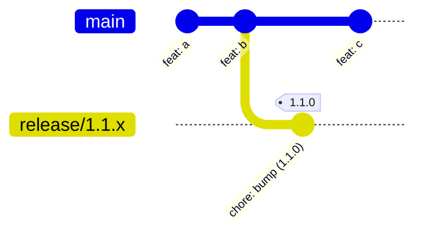
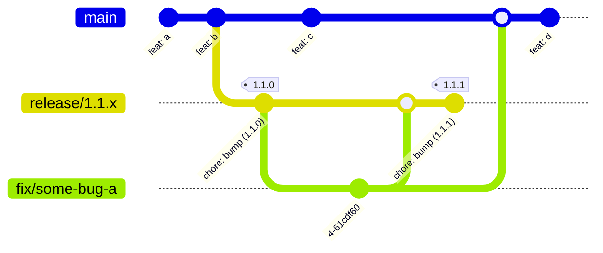
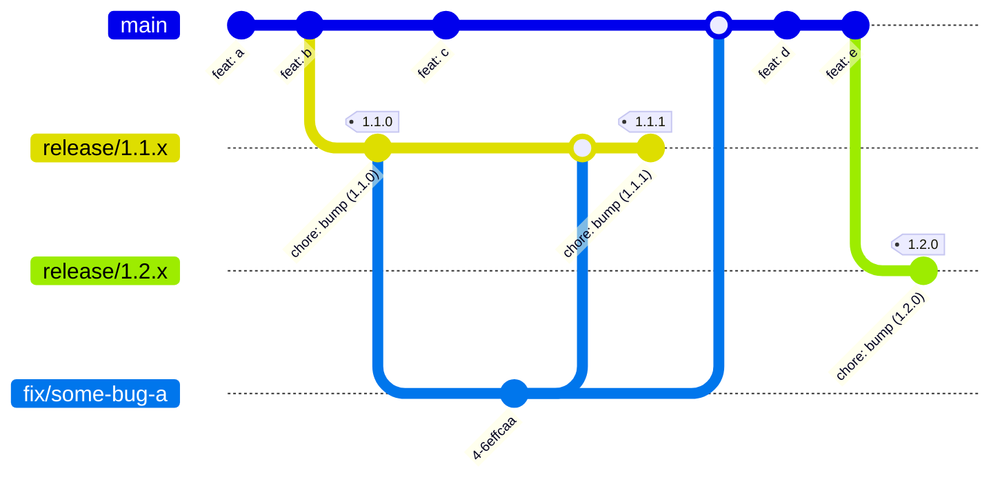
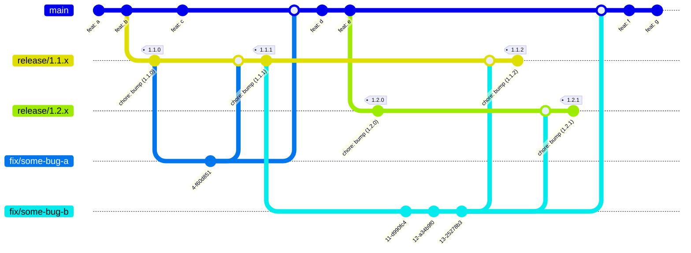
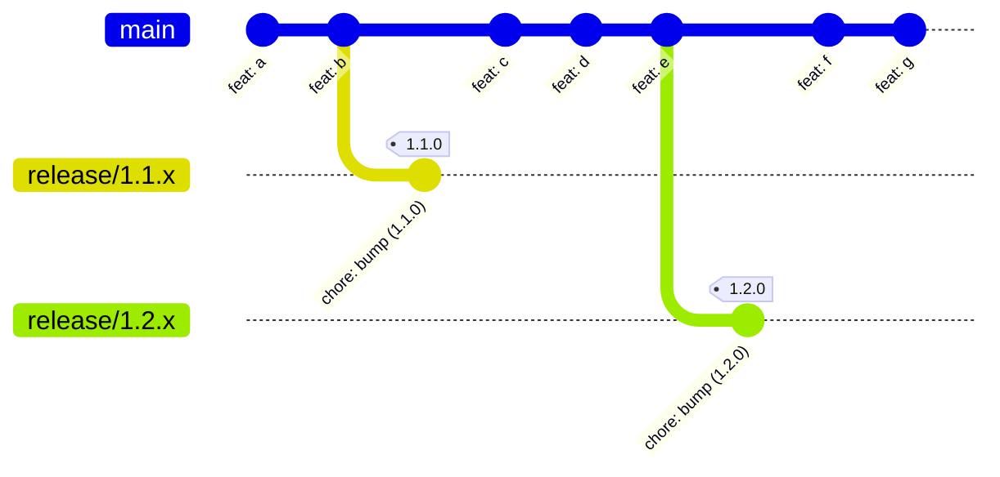
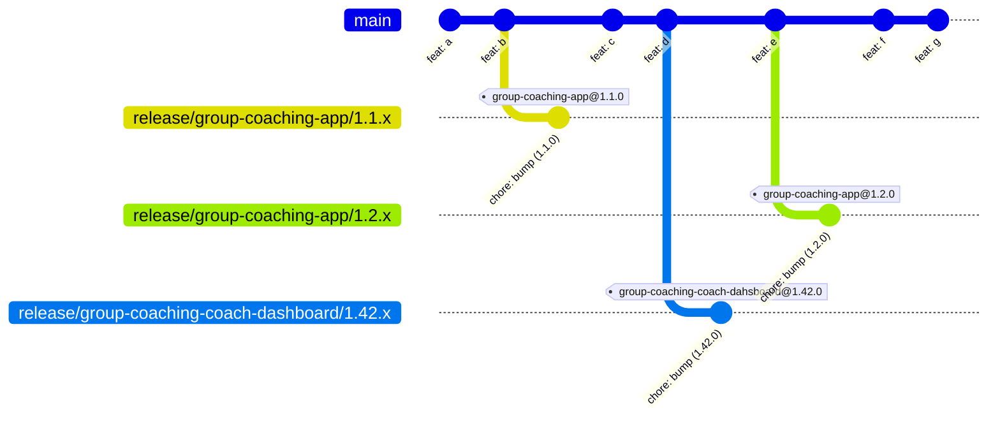
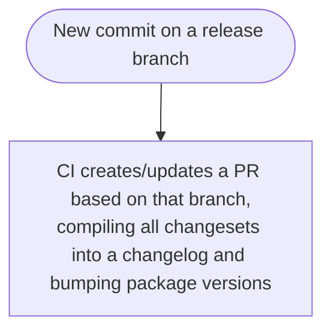
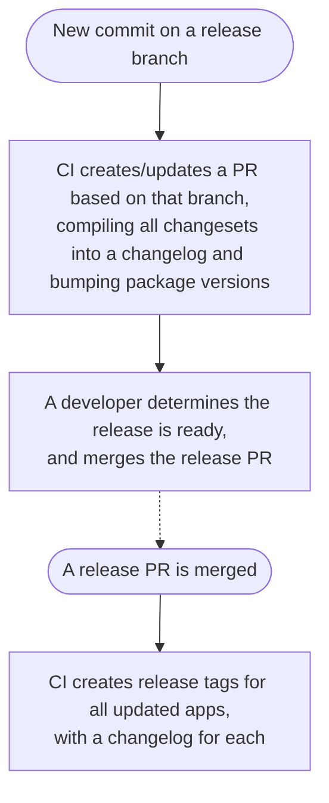
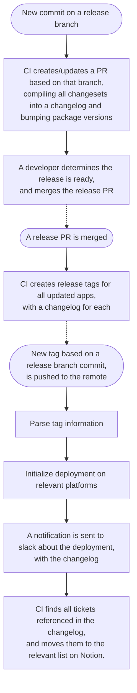

# Boon apps release flow proposal

This repo is intended to demo a potential release flow, where most actions is automated based on git state.

## Goals

These are the prioritized aims of the flow.

1. **Convenient** - Any addition must be a net win in productivity, at the very least removing as much hassle as it adds.
2. **Automatic** - If an action _can be_ automatic, it _should be_ automatic.
3. **Legacy Support** - It should be easy and fast to support legacy major & minor versions of _all_ apps.
4. **Transparent** - Ideally, the flow would also take care of keeping changelogs and posting on Slack, to let the team know what's moving.

## Git visualization

Let's try and visualize a few practical use cases, building on top of one-another!

### Case-study: A simple release without issues

Let's begin by visualizing a simple release.

In the above example, we see features being pushed to the `main` branch, and when the feature-set is ripe for release, the `release/1.1.x` branch is made for the release to live in.
A single version bump commit it pushed to the `release/1.1.x` branch, and then a tag is created at that point to represent an actual release.

### Case-study: A bug is discovered that needs to be patched in 1.1.x

Now, let's say that a bug is discovered, and we need to create a patch for it.
Building upon the previous visualization we might get something like this:

A `fix/` branch is created for the bug on the _lowest supported version where the bug exists_.
In this case that is `release/1.1.x`, so we create `fix/some-bug-a` from that release branch.

Once the bug is fixed, the `fix/` branch is merged into _all relevant branches of the base version **or newer**_.
In this case, that is `release/1.1.x` and `main`, it might happen that the bug simply no longer exists on `main`, in which case it's okay not to merge into `main`.

When the merge into `release/1.1.x` is pushed, package versions are bumped and a new release tag are again created at that commit.

### Case-study: There's features enough for a new minor release

This is handled in a very similar manner to how `1.1.x` were released.

There is no more novel information to add here.

### Case-study: A new bug is discovered, and it affects both `1.1.x` and `1.2.x`

This case is again similar to an earlier case, here it is the earlier bug fix case.

So again, the `fix/` branch is based on the _earliest supported version with the issue_, and when done, is merged into _that same and all following versions affected by that same issue_.

This way, we should be able to easily patch old versions that are still adequately used by the users to warrant support.

### Case-study: Adding cherry-picking

Let's examine how this would look of we were to fix issues on the `main` branch and then use cherry-picking for distribution to `release/` branches.

_Note: GitHub doesn't support cherry-pick in mermaid, so here's an embed. Edit it [here](https://mermaid.live/edit#pako:eNqlk81OwzAMx18l8gmkMdYccwbxANxQLm7ittGapvJSadO0dycdm1DGyjq4xfbfXz8rezDBEiioXXxj7BvdCWEaMuswROHRdUdH8N5F4azSUBFGJVDD9UA5Bq4WKRk70wimlnBDz8WyWG5FYEusxOqymGkCU6o2-F48jNLVowYRsU6xoznZ5udIZp7WbU9rZdJs3FOEeffUO7O-TLyxQpGvUNyxgp3CTfNxy2_cxY1ZZY5bzsU9kij_irCcgVDmCOUvveT_esn8XPKuc1VT56o1wAI8ccq16dftR5mG2JBPl1TpaanCoY1jgUOSDr3FSK_WxcCgIg-0ABxieN915mx_aV4c1oz-7Oyx-wghmRW2Gzp8AooBRbU).

The most immediate difference is that the `fix/` branches are missing. Consider that the merging would usually occur through squash, as such in the earlier cases the `fix/` branches should now be considered a permanently visible part of the history.

Wether or not this is the way to go remains uncertain.

### Case-study: Multiple apps

Alright, so obviously there's more than one app to keep track of. The current branch naming doesn't really allow for this without strong version binding between apps, which is quite unreasonable.

A way to fix this would be to add an extra `folder` to the branch names. Let's take a look at how that would look like, in a scenario without bug-fix noise.

Here is the clean git tree, _without_ any measures to support multiple apps releases.

And here it is again _with_ support for multiple apps releases.

Now, the `group-coaching-coach-dashboard` app is a web project, so we don't really have to support it beyond 1 minor version, but this structure will enable us to perform rollbacks when necessary, so it still have some value.

With this structure, the CI will know exactly which app to release for each branch.

## Automation

So by now you're likely thinking, "cool, but that doesn't really improve anything, you just made the branching model slightly more strict and added tags..." You would be right to say this, but it's still a pretty big win for automation. Let's look at some potential flows!

### Case-study: A developer creates a release branch, or a new commit is added to an existing release branch

In this case, a developer actively pushes new code to be released imminently. The CI should then take action to prepare for a release.

In the above flow, we see that the CI prepares the release in a new PR, which will allow developers review the release before merging the PR.

### Case-study: The developer decides they're happy with the release, and merges the release PR

So the developer looks through the changelog, and makes sure that everything looks as it should. This could also be a good time to make sure the backend is ready for the release. They then decide that it's time to release the new version of the app.

Through merging the CI can create the git state that signifies a release. Potentially triggering more actions to be explored in the next case-study.

### Case-study: A new release tag is created, and the release should be deployed

With the release tag ready and containing all the relevant release info, a new trigger can act on the created tag.

_Note: As I remember, it's technically not possible to act on a tag created by another GitHub Action. But it can all run in the same GitHub Action. For simplicity's sake, I'll refer to it as a trigger on a new release tag._

So already the last step contains a lot of automation, and there's really a lot of potential to add automation throughout, especially in regards to notion.
