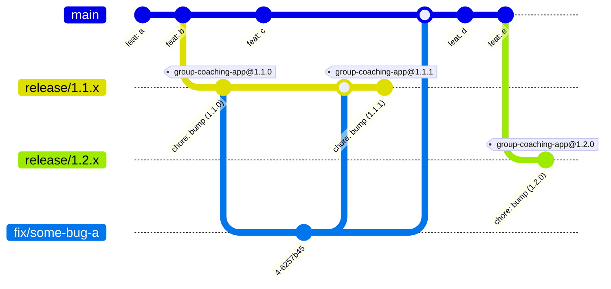

# Boon apps release flow proposal

This repo is intended to demo a potential release flow, where most actions is automated based on git state.

## Goals

These are the prioritized aims of the flow.

1. **Convenient** - Any addition must be a net win in productivity, at the very least removing as much hassle as it adds.
2. **Automatic** - If an action _can be_ automatic, it _should be_.
3. **Legacy Support** - It should be easy and fast to support legacy major & minor versions of _all_ apps.
4. **Transparent** - Ideally, the flow would also take care of keeping changelogs and posting on Slack, to let the team know what's moving.

## Git visualization

Let's try and visualize a few practical use cases, building on top of one-another!

### Case-study: A simple release without issues

Let's begin by visualizing a simple release.

In the above example, we see features being pushed to the `main` branch, and when the feature-set is ripe for release, the `release/1.1.x` branch is made for the release to live in.
A single version bump commit it pushed to the `release/1.1.x` branch, and then a tag is created at that point to represent an actual release.

### Case-study: A bug is discovered that needs to be patched in 1.1.x

Now, let's say that a bug is discovered, and we need to create a patch for it.
Building upon the previous visualization we might get something like this:

A `fix/` branch is created for the bug on the _lowest supported version where the bug exists_.
In this case that is `release/1.1.x`, so we create `fix/some-bug-a` from that release branch.

Once the bug is fixed, the `fix/` branch is merged into _all relevant branches of the base version **or newer**_.
In this case, that is `release/1.1.x` and `main`, it might happen that the bug simply no longer exists on `main`, in which case it's okay not to merge into `main`.

When the merge into `release/1.1.x` is pushed, package versions are bumped and a new release tag are again created at that commit.

### Case-study: There's features enough for a new minor release

This is handled in a very similar manner to how `1.1.x` were released.

There is no more novel information to add here.

### Case-study: A new bug is discovered, and it affects both `1.1.x` and `1.2.x`

This case is again similar to an earlier case, here it is the earlier bug fix case.

So again, the `fix/` branch is based on the _earliest supported version with the issue_, and when done, is merged into _that same and all following versions affected by that same issue_.

This way, we should be able to easily patch old versions that are still adequately used by the users to warrant support.

### Case-study: Adding cherry-picking

Let's examine how this would look of we were to fix issues on the `main` branch and then use cherry-picking for distribution to `release/` branches.

The most immediate difference is that the `fix/` branches are missing. Consider that the merging would usually occur through squash, as such in the earlier cases the `fix/` branches should now be considered a permanently visible part of the history.
